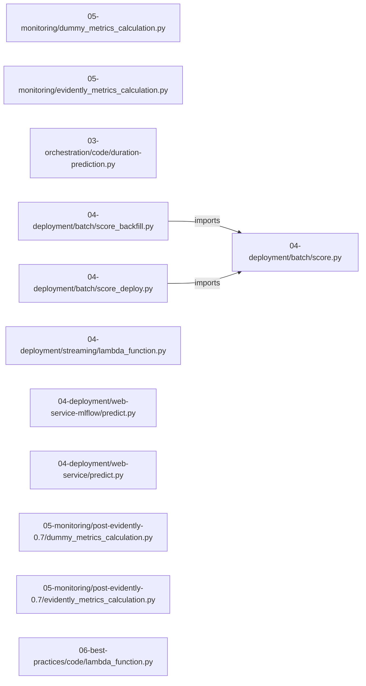

# mlops-zoomcamp — project architecture

[README](README.md) · [Interview questions and answers](INTERVIEW_QA.md)

## Purpose and scope

Course materials and exercises for productionizing machine learning services through training, deployment, orchestration, and monitoring.

This document describes files and symbols in this checkout. Deployment templates and statements in the original overview are distinguished from a verified running environment.

## Component diagram



For Python repositories, arrows show resolved local imports, not network calls or deployment order. Otherwise the diagram is a repository component map; containment arrows do not assert runtime integration.

## Components and responsibilities

| Component | Responsibility |
| --- | --- |
| [`04-deployment/web-service-mlflow/predict.py`](04-deployment/web-service-mlflow/predict.py) | HTTP handlers: `ROUTE /predict` |
| [`04-deployment/web-service/predict.py`](04-deployment/web-service/predict.py) | HTTP handlers: `ROUTE /predict` |
| [`cohorts/2022/05-monitoring/homework/prediction_service/app.py`](cohorts/2022/05-monitoring/homework/prediction_service/app.py) | HTTP handlers: `ROUTE /`, `ROUTE /predict-duration` |
| [`cohorts/2023/03-orchestration/prefect/3.5/orchestrate_s3.py`](cohorts/2023/03-orchestration/prefect/3.5/orchestrate_s3.py) | Functions: `read_data`, `add_features`, `train_best_model`, `main_flow_s3` |
| [`cohorts/2023/03-orchestration/prefect/3.6/orchestrate_s3.py`](cohorts/2023/03-orchestration/prefect/3.6/orchestrate_s3.py) | Functions: `read_data`, `add_features`, `train_best_model`, `main_flow_s3` |
| [`cohorts/2023/02-experiment-tracking/homework-wandb/preprocess_data.py`](cohorts/2023/02-experiment-tracking/homework-wandb/preprocess_data.py) | Functions: `dump_pickle`, `read_dataframe`, `preprocess`, `run_data_prep` |
| [`cohorts/2023/03-orchestration/prefect/3.3/orchestrate.py`](cohorts/2023/03-orchestration/prefect/3.3/orchestrate.py) | Functions: `read_data`, `add_features`, `train_best_model`, `main_flow` |
| [`cohorts/2023/03-orchestration/prefect/3.3/orchestrate_pre_prefect.py`](cohorts/2023/03-orchestration/prefect/3.3/orchestrate_pre_prefect.py) | Functions: `read_data`, `add_features`, `train_best_model`, `main_flow` |
| [`cohorts/2023/03-orchestration/prefect/3.4/orchestrate.py`](cohorts/2023/03-orchestration/prefect/3.4/orchestrate.py) | Functions: `read_data`, `add_features`, `train_best_model`, `main_flow` |
| [`02-experiment-tracking/requirements.txt`](02-experiment-tracking/requirements.txt) | Implementation or supporting configuration |
| [`05-monitoring/requirements.txt`](05-monitoring/requirements.txt) | Implementation or supporting configuration |
| [`06-best-practices/code/infrastructure/main.tf`](06-best-practices/code/infrastructure/main.tf) | Terraform resource/module declarations |
| [`06-best-practices/code/infrastructure/modules/ecr/main.tf`](06-best-practices/code/infrastructure/modules/ecr/main.tf) | Terraform resource/module declarations |
| [`06-best-practices/code/infrastructure/modules/ecr/variables.tf`](06-best-practices/code/infrastructure/modules/ecr/variables.tf) | Terraform resource/module declarations |
| [`06-best-practices/code/infrastructure/modules/kinesis/main.tf`](06-best-practices/code/infrastructure/modules/kinesis/main.tf) | Terraform resource/module declarations |
| [`06-best-practices/code/infrastructure/modules/kinesis/variables.tf`](06-best-practices/code/infrastructure/modules/kinesis/variables.tf) | Terraform resource/module declarations |
| [`05-monitoring/dummy_metrics_calculation.py`](05-monitoring/dummy_metrics_calculation.py) | Functions: `prep_db`, `calculate_dummy_metrics_postgresql`, `main` |
| [`05-monitoring/evidently_metrics_calculation.py`](05-monitoring/evidently_metrics_calculation.py) | Functions: `prep_db`, `calculate_metrics_postgresql`, `batch_monitoring_backfill` |
| [`03-orchestration/code/duration-prediction.py`](03-orchestration/code/duration-prediction.py) | Functions: `read_dataframe`, `create_X`, `train_model`, `run` |
| [`04-deployment/batch/score.py`](04-deployment/batch/score.py) | Functions: `generate_uuids`, `read_dataframe`, `prepare_dictionaries`, `load_model`, `save_results`, `apply_model`, `get_paths` |
| [`04-deployment/batch/score_backfill.py`](04-deployment/batch/score_backfill.py) | Functions: `ride_duration_prediction_backfill` |
| [`04-deployment/batch/score_deploy.py`](04-deployment/batch/score_deploy.py) | Implementation or supporting configuration |

## Request interface

| Method and path | Handler | Source |
| --- | --- | --- |
| `ROUTE /predict` | `predict_endpoint` | [`04-deployment/web-service-mlflow/predict.py`](04-deployment/web-service-mlflow/predict.py#L31) |
| `ROUTE /predict` | `predict_endpoint` | [`04-deployment/web-service/predict.py`](04-deployment/web-service/predict.py#L26) |
| `ROUTE /` | `get_info` | [`cohorts/2022/05-monitoring/homework/prediction_service/app.py`](cohorts/2022/05-monitoring/homework/prediction_service/app.py#L49) |
| `ROUTE /predict-duration` | `predict_duration` | [`cohorts/2022/05-monitoring/homework/prediction_service/app.py`](cohorts/2022/05-monitoring/homework/prediction_service/app.py#L66) |

The table lists literal route decorators found in the inspected Python modules. Router prefixes and middleware can add behavior; check the linked handler and application setup before calling an endpoint.

## Implementation walkthrough

### `train_best_model(X_train: scipy.sparse._csr.csr_matrix, X_val: scipy.sparse._csr.csr_matrix, y_train: np.ndarray, y_val: np.ndarray, dv: sklearn.feature_extraction.DictVectorizer)`

Source: [`cohorts/2023/03-orchestration/prefect/3.5/orchestrate_s3.py`](cohorts/2023/03-orchestration/prefect/3.5/orchestrate_s3.py#L69).

train a model with best hyperparams and write everything out

Calls visible in this function: `booster.predict`, `create_markdown_artifact`, `date.today`, `mean_squared_error`, `mlflow.log_artifact`, `mlflow.log_metric`, `mlflow.log_params`, `mlflow.start_run`, `mlflow.xgboost.log_model`, `open`, `pathlib.Path`, `pathlib.Path('models').mkdir`.

```python
def train_best_model(
    X_train: scipy.sparse._csr.csr_matrix,
    X_val: scipy.sparse._csr.csr_matrix,
    y_train: np.ndarray,
    y_val: np.ndarray,
    dv: sklearn.feature_extraction.DictVectorizer,
) -> None:
    """train a model with best hyperparams and write everything out"""

    with mlflow.start_run():
        train = xgb.DMatrix(X_train, label=y_train)
        valid = xgb.DMatrix(X_val, label=y_val)

        best_params = {
            "learning_rate": 0.09585355369315604,
            "max_depth": 30,
            "min_child_weight": 1.060597050922164,
            "objective": "reg:linear",
            "reg_alpha": 0.018060244040060163,
            "reg_lambda": 0.011658731377413597,
            "seed": 42,
        }
```

The excerpt is truncated; the linked source contains the full implementation.

### `train_best_model(X_train: scipy.sparse._csr.csr_matrix, X_val: scipy.sparse._csr.csr_matrix, y_train: np.ndarray, y_val: np.ndarray, dv: sklearn.feature_extraction.DictVectorizer)`

Source: [`cohorts/2023/03-orchestration/prefect/3.6/orchestrate_s3.py`](cohorts/2023/03-orchestration/prefect/3.6/orchestrate_s3.py#L69).

train a model with best hyperparams and write everything out

Calls visible in this function: `booster.predict`, `create_markdown_artifact`, `date.today`, `mean_squared_error`, `mlflow.log_artifact`, `mlflow.log_metric`, `mlflow.log_params`, `mlflow.start_run`, `mlflow.xgboost.log_model`, `open`, `pathlib.Path`, `pathlib.Path('models').mkdir`.

```python
def train_best_model(
    X_train: scipy.sparse._csr.csr_matrix,
    X_val: scipy.sparse._csr.csr_matrix,
    y_train: np.ndarray,
    y_val: np.ndarray,
    dv: sklearn.feature_extraction.DictVectorizer,
) -> None:
    """train a model with best hyperparams and write everything out"""

    with mlflow.start_run():
        train = xgb.DMatrix(X_train, label=y_train)
        valid = xgb.DMatrix(X_val, label=y_val)

        best_params = {
            "learning_rate": 0.09585355369315604,
            "max_depth": 30,
            "min_child_weight": 1.060597050922164,
            "objective": "reg:linear",
            "reg_alpha": 0.018060244040060163,
            "reg_lambda": 0.011658731377413597,
            "seed": 42,
        }
```

The excerpt is truncated; the linked source contains the full implementation.

### `run_data_prep(wandb_project: str, wandb_entity: str, raw_data_path: str, dest_path: str, dataset: str='green')`

Source: [`cohorts/2023/02-experiment-tracking/homework-wandb/preprocess_data.py`](cohorts/2023/02-experiment-tracking/homework-wandb/preprocess_data.py#L48).

Calls visible in this function: `DictVectorizer`, `artifact.add_dir`, `click.command`, `click.option`, `dump_pickle`, `os.makedirs`, `os.path.join`, `preprocess`, `read_dataframe`, `wandb.Artifact`, `wandb.init`, `wandb.log_artifact`.

```python
def run_data_prep(
    wandb_project: str,
    wandb_entity: str,
    raw_data_path: str,
    dest_path: str,
    dataset: str = "green",
):
    # Initialize a Weights & Biases run
    wandb.init(project=wandb_project, entity=wandb_entity, job_type="preprocess")

    # Load parquet files
    df_train = read_dataframe(
        os.path.join(raw_data_path, f"{dataset}_tripdata_2022-01.parquet")
    )
    df_val = read_dataframe(
        os.path.join(raw_data_path, f"{dataset}_tripdata_2022-02.parquet")
    )
    df_test = read_dataframe(
        os.path.join(raw_data_path, f"{dataset}_tripdata_2022-03.parquet")
    )

    # Extract the target
```

The excerpt is truncated; the linked source contains the full implementation.

### `train_best_model(X_train: scipy.sparse._csr.csr_matrix, X_val: scipy.sparse._csr.csr_matrix, y_train: np.ndarray, y_val: np.ndarray, dv: sklearn.feature_extraction.DictVectorizer)`

Source: [`cohorts/2023/03-orchestration/prefect/3.3/orchestrate.py`](cohorts/2023/03-orchestration/prefect/3.3/orchestrate.py#L66).

train a model with best hyperparams and write everything out

Calls visible in this function: `booster.predict`, `mean_squared_error`, `mlflow.log_artifact`, `mlflow.log_metric`, `mlflow.log_params`, `mlflow.start_run`, `mlflow.xgboost.log_model`, `open`, `pathlib.Path`, `pathlib.Path('models').mkdir`, `pickle.dump`, `task`.

```python
def train_best_model(
    X_train: scipy.sparse._csr.csr_matrix,
    X_val: scipy.sparse._csr.csr_matrix,
    y_train: np.ndarray,
    y_val: np.ndarray,
    dv: sklearn.feature_extraction.DictVectorizer,
) -> None:
    """train a model with best hyperparams and write everything out"""

    with mlflow.start_run():
        train = xgb.DMatrix(X_train, label=y_train)
        valid = xgb.DMatrix(X_val, label=y_val)

        best_params = {
            "learning_rate": 0.09585355369315604,
            "max_depth": 30,
            "min_child_weight": 1.060597050922164,
            "objective": "reg:linear",
            "reg_alpha": 0.018060244040060163,
            "reg_lambda": 0.011658731377413597,
            "seed": 42,
        }
```

The excerpt is truncated; the linked source contains the full implementation.

## Validation and failure paths

| Explicit exception | Source |
| --- | --- |
| `Exception()` | [`cohorts/2023/03-orchestration/prefect/3.2/cat_facts.py`](cohorts/2023/03-orchestration/prefect/3.2/cat_facts.py#L10) |

These are explicit exceptions in the inspected source, rather than a claim that every failure is handled. Follow the calling handler to see whether the exception becomes an HTTP response or propagates.

## Data and state

- [`05-monitoring/evidently_metrics_calculation.py`](05-monitoring/evidently_metrics_calculation.py) defines module-level containers: `num_features`, `cat_features`.
- [`05-monitoring/post-evidently-0.7/evidently_metrics_calculation.py`](05-monitoring/post-evidently-0.7/evidently_metrics_calculation.py) defines module-level containers: `num_features`, `cat_features`.
- [`cohorts/2022/02-experiment-tracking/homework/register_model.py`](cohorts/2022/02-experiment-tracking/homework/register_model.py) defines module-level containers: `SPACE`.
- [`cohorts/2022/04-deployment/homework/batch.py`](cohorts/2022/04-deployment/homework/batch.py) defines module-level containers: `categorical`.
- [`cohorts/2022/05-monitoring/homework/prepare.py`](cohorts/2022/05-monitoring/homework/prepare.py) defines module-level containers: `files`.
- [`cohorts/2022/06-best-practices/homework/batch.py`](cohorts/2022/06-best-practices/homework/batch.py) defines module-level containers: `categorical`.

Module-level dictionaries/lists live in a Python process. They can be fixtures or mutable state; inspect writes before treating them as persistent storage. A production extension would need to define persistence and concurrency behavior explicitly.

## Infrastructure declarations

| Kind | Address | Source |
| --- | --- | --- |
| data | `aws_caller_identity.current_identity` | [`06-best-practices/code/infrastructure/main.tf`](06-best-practices/code/infrastructure/main.tf) |
| resource | `aws_ecr_repository.repo` | [`06-best-practices/code/infrastructure/modules/ecr/main.tf`](06-best-practices/code/infrastructure/modules/ecr/main.tf) |
| resource | `aws_kinesis_stream.stream` | [`06-best-practices/code/infrastructure/modules/kinesis/main.tf`](06-best-practices/code/infrastructure/modules/kinesis/main.tf) |
| resource | `aws_iam_role.iam_lambda` | [`06-best-practices/code/infrastructure/modules/lambda/iam.tf`](06-best-practices/code/infrastructure/modules/lambda/iam.tf) |
| resource | `aws_iam_policy.allow_kinesis_processing` | [`06-best-practices/code/infrastructure/modules/lambda/iam.tf`](06-best-practices/code/infrastructure/modules/lambda/iam.tf) |
| resource | `aws_iam_role_policy_attachment.kinesis_processing` | [`06-best-practices/code/infrastructure/modules/lambda/iam.tf`](06-best-practices/code/infrastructure/modules/lambda/iam.tf) |
| resource | `aws_iam_role_policy.inline_lambda_policy` | [`06-best-practices/code/infrastructure/modules/lambda/iam.tf`](06-best-practices/code/infrastructure/modules/lambda/iam.tf) |
| resource | `aws_lambda_permission.allow_cloudwatch_to_trigger_lambda_function` | [`06-best-practices/code/infrastructure/modules/lambda/iam.tf`](06-best-practices/code/infrastructure/modules/lambda/iam.tf) |
| resource | `aws_iam_policy.allow_logging` | [`06-best-practices/code/infrastructure/modules/lambda/iam.tf`](06-best-practices/code/infrastructure/modules/lambda/iam.tf) |
| resource | `aws_iam_role_policy_attachment.lambda_logs` | [`06-best-practices/code/infrastructure/modules/lambda/iam.tf`](06-best-practices/code/infrastructure/modules/lambda/iam.tf) |
| resource | `aws_iam_policy.lambda_s3_role_policy` | [`06-best-practices/code/infrastructure/modules/lambda/iam.tf`](06-best-practices/code/infrastructure/modules/lambda/iam.tf) |
| resource | `aws_iam_role_policy_attachment.iam-policy-attach` | [`06-best-practices/code/infrastructure/modules/lambda/iam.tf`](06-best-practices/code/infrastructure/modules/lambda/iam.tf) |
| resource | `aws_lambda_function.kinesis_lambda` | [`06-best-practices/code/infrastructure/modules/lambda/main.tf`](06-best-practices/code/infrastructure/modules/lambda/main.tf) |
| resource | `aws_lambda_function_event_invoke_config.kinesis_lambda_event` | [`06-best-practices/code/infrastructure/modules/lambda/main.tf`](06-best-practices/code/infrastructure/modules/lambda/main.tf) |
| resource | `aws_lambda_event_source_mapping.kinesis_mapping` | [`06-best-practices/code/infrastructure/modules/lambda/main.tf`](06-best-practices/code/infrastructure/modules/lambda/main.tf) |
| resource | `aws_s3_bucket.s3_bucket` | [`06-best-practices/code/infrastructure/modules/s3/main.tf`](06-best-practices/code/infrastructure/modules/s3/main.tf) |

These are declarations in the checkout. Provisioning, an authenticated provider, remote state, and a successful deployment are separate operational steps. Refer to the environment-specific instructions before planning changes.

## Data flow and design decisions

### What is the input-to-output contract of `train_best_model`

In [`cohorts/2023/03-orchestration/prefect/3.5/orchestrate_s3.py`](cohorts/2023/03-orchestration/prefect/3.5/orchestrate_s3.py#L69), `train_best_model(X_train: scipy.sparse._csr.csr_matrix, X_val: scipy.sparse._csr.csr_matrix, y_train: np.ndarray, y_val: np.ndarray, dv: sklearn.feature_extraction.DictVectorizer)` receives the inputs. The function computes these intermediate values:

The implementation delegates or iterates directly; trace the calls in the source walkthrough.

Its result is defined by:

- `None`

### Which Terraform modules compose the environment

- `module.source_kinesis_stream` uses `./modules/kinesis` in [`06-best-practices/code/infrastructure/main.tf`](06-best-practices/code/infrastructure/main.tf).
- `module.output_kinesis_stream` uses `./modules/kinesis` in [`06-best-practices/code/infrastructure/main.tf`](06-best-practices/code/infrastructure/main.tf).
- `module.s3_bucket` uses `./modules/s3` in [`06-best-practices/code/infrastructure/main.tf`](06-best-practices/code/infrastructure/main.tf).
- `module.ecr_image` uses `./modules/ecr` in [`06-best-practices/code/infrastructure/main.tf`](06-best-practices/code/infrastructure/main.tf).
- `module.lambda_function` uses `./modules/lambda` in [`06-best-practices/code/infrastructure/main.tf`](06-best-practices/code/infrastructure/main.tf).

Review each module’s variable and output contracts. Different environment declarations may reuse a module with different inputs; state and provider configuration determine the actual deployment boundary.

## Setup and verification

The following commands are derived from the checked-in dependency/test contracts. Execute them from the repository root; the block prepares a local environment, not a cloud deployment.

```bash
python3 -m venv .venv
source .venv/bin/activate
python -m pip install -r 02-experiment-tracking/requirements.txt
```

Python dependencies: [`02-experiment-tracking/requirements.txt`](02-experiment-tracking/requirements.txt), [`05-monitoring/requirements.txt`](05-monitoring/requirements.txt), [`05-monitoring/post-evidently-0.7/requirements.txt`](05-monitoring/post-evidently-0.7/requirements.txt), [`cohorts/2024/03-orchestration/requirements.txt`](cohorts/2024/03-orchestration/requirements.txt), [`06-best-practices/code/integration-test/model/requirements.txt`](06-best-practices/code/integration-test/model/requirements.txt), [`cohorts/2022/05-monitoring/homework/requirements.txt`](cohorts/2022/05-monitoring/homework/requirements.txt).

Test entry points: [`04-deployment/streaming/test_docker.py`](04-deployment/streaming/test_docker.py), [`06-best-practices/code/integration-test/test_docker.py`](06-best-practices/code/integration-test/test_docker.py), [`06-best-practices/code/integration-test/test_kinesis.py`](06-best-practices/code/integration-test/test_kinesis.py), [`06-best-practices/code/scripts/test_cloud_e2e.sh`](06-best-practices/code/scripts/test_cloud_e2e.sh), [`06-best-practices/code/tests/__init__.py`](06-best-practices/code/tests/__init__.py), [`06-best-practices/code/tests/data.b64`](06-best-practices/code/tests/data.b64).

Automation definitions: [`.github/workflows/cd-deploy.yml`](.github/workflows/cd-deploy.yml), [`.github/workflows/ci-tests.yml`](.github/workflows/ci-tests.yml). Read their triggers and job steps to determine what CI actually runs.

## Operating boundaries and design review

Before turning this checkout into a customer deployment, establish the input contract, data ownership, access controls, failure response, evaluation criteria, and rollback owner. Repository fixtures and unit tests demonstrate local behavior; they do not establish throughput, uptime, compliance, or business impact.

A useful architecture review starts with the linked implementation: identify where input enters, where a decision is made, which state can change, and which external dependency can fail. Add a deployment view only for infrastructure that is actually configured and exercised.
